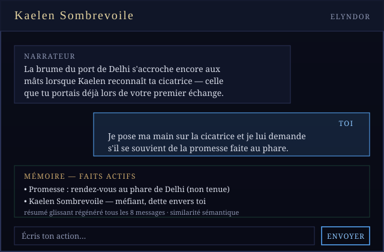

<div align="center">


<br />

[](https://github.com/artisanguillonrenov-creator/logiciel-rp-beta/actions/workflows/pr-validation.yml)
[](LICENSE)
[](https://docs.expo.dev/versions/v57.0.0/)
[](#lancer-la-b%C3%AAta)
[](#)

**Le logiciel porte l'autorité. Le modèle ne fournit que le langage.**

</div>

---

## Table des matières

- [Qu'est-ce qu'Elyndor](#quest-ce-quelyndor)
- [Fonctionnalités](#fonctionnalités)
- [Architecture technique](#architecture-technique)
- [Lancer la bêta](#lancer-la-bêta)
- [Configuration](#configuration)
- [Structure du dépôt](#structure-du-dépôt)
- [Exemples](#exemples)
- [Identité visuelle](#identité-visuelle)
- [Roadmap](#roadmap)
- [Contribuer](#contribuer)
- [Licence](#licence)

---

## Qu'est-ce qu'Elyndor

**Elyndor** est un continent de fantasy — peuplé de hautes-elfes, d'amazones
nordiques, d'orques nobles, de sirènes, de géantes et de neuf autres peuples
répartis sur autant de territoires — servant de décor par défaut à une
application de jeu de rôle textuel sur Android.

Ce que ce dépôt implémente n'est **pas un chatbot avec un prompt système**.
C'est un moteur narratif où l'autorité sur les règles, la mémoire et l'état
du monde appartient au **logiciel**, pas au modèle de langage — le modèle ne
sert qu'à mettre en mots ce que le logiciel autorise. Concrètement :

- **7 règles immuables** priment toujours sur le reste (`src/engine/rules.ts`) :
  autonomie stricte du joueur, canon géré par le logiciel, état du monde géré
  par le logiciel, PNJ à connaissance limitée, aucune invention du modèle
  validée directement en canon, contradictions interdites, l'IA ne contrôle
  jamais le joueur.
- **102 entrées de lore Elyndor** et **15 métamoteurs** (règles de mise en
  scène) sont sélectionnés à chaque tour **par similarité sémantique**
  (embeddings), pas par mots-clés — un PNJ mentionné avec un vocabulaire
  différent du lorebook continue de déclencher les bonnes fiches.
- Une **mémoire persistante à plusieurs niveaux (L0→L5)** évite l'oubli et
  les contradictions qui rongent les sessions longues sur les plateformes
  génériques.
- Chaque réponse passe une **validation de sortie** (heuristique locale +
  contrôle par le modèle) avant affichage.

Aucun build ni compte développeur requis pour tester : l'app tourne dans
**Expo Go**, scannée depuis un QR code.

## Fonctionnalités

<table>
<tr>
<td width="72" valign="top"></td>
<td>

**Règles immuables**
Sept règles non négociables, toujours injectées, jamais soumises à une
sélection par pertinence — elles priment sur tout métamoteur, tout lore et
toute autre instruction en cas de conflit. `src/engine/rules.ts`

</td>
</tr>
<tr>
<td width="72" valign="top"></td>
<td>

**Mémoire persistante L0→L5**
Résumé glissant régénéré tous les 8 messages, extraction de faits candidats,
déduplication par embeddings, canonisation sous réserve d'absence de
contradiction, décroissance douce des faits non reconfirmés (jamais de
suppression). Commande joueur `/retiens …` ou « retiens que … » pour forcer
un fait en mémoire canon immédiatement, sans appel modèle. `src/engine/memory.ts`

</td>
</tr>
<tr>
<td width="72" valign="top"></td>
<td>

**Lore Elyndor & lore émergent**
102 entrées du lorebook statique, plus un pipeline de **lore émergent** qui
capture les PNJ, lieux, objets, factions et événements créés en cours de
partie et les rend durables une fois reconfirmés. `src/engine/loreLoader.ts`,
`src/engine/emergentLore.ts`

</td>
</tr>
<tr>
<td width="72" valign="top"></td>
<td>

**15 métamoteurs**
Les règles qui gouvernent *comment* toute réponse est produite (registre,
continuité, agentivité du joueur…), chargées depuis un lorebook au format
RISU et actives à chaque tour. `src/data/metamoteurs.json`

</td>
</tr>
<tr>
<td width="72" valign="top"></td>
<td>

**Validation de sortie**
Contrôle heuristique local (tournures qui décident à la place du joueur) +
contrôle par le modèle (continuité, canon, contradiction) sur chaque
réponse, avec une nouvelle tentative en cas de violation détectée.
`src/engine/validator.ts`

</td>
</tr>
<tr>
<td width="72" valign="top"></td>
<td>

**Directeur narratif, simulation du monde, dynamiques sociales**
Suivi de l'arc narratif et de la tension dramatique (`storyDirector.ts`),
zones du monde qui continuent d'exister hors champ avec des déclencheurs
évalués localement (`worldSimulation.ts`), et relations PNJ multi-axes
(confiance, respect, peur, affection, hostilité) avec propagation limitée par
faction (`socialDynamics.ts`).

</td>
</tr>
</table>

Au-delà du cœur narratif : personas réutilisables, branches de conversation
multiples, packs de contenu (« plugins ») sans exécution de code, export de
conversation, génération d'images de scène à la demande, inférence locale
via un modèle embarqué (`expo-litert-lm`) comme alternative à OpenRouter,
interface traduisible (`src/i18n/`), et un contrôle de profil de contenu
(grand public / adulte) imposé par le logiciel plutôt que laissé au modèle.

## Architecture technique

```
                    ┌─────────────────────────────┐
                    │   RÈGLES IMMUABLES (x7)      │  toujours injectées
                    │   src/engine/rules.ts        │
                    └───────────────┬─────────────┘
                                    │
   Message joueur ──► sélection sémantique (embeddings) ──► construction du contexte
                                    │
        ┌───────────────┬──────────┼───────────┬───────────────┐
        ▼               ▼          ▼           ▼               ▼
   15 métamoteurs   102 entrées  Mémoire    Directeur /     Dynamiques
   (loreLoader)     lore Elyndor L0→L5      Monde /         sociales
                     + lore      (memory)   Lore émergent   (socialDynamics)
                     émergent               (storyDirector,
                                             worldSimulation,
                                             emergentLore)
        └───────────────┴──────────┬───────────┴───────────────┘
                                    ▼
                     promptBuilder.ts — construction du prompt
                                    │
                    OpenRouter / Infermatic / inférence locale
                          (openrouter.ts, localInference.ts)
                                    │
                                    ▼
                     validator.ts — heuristique + contrôle modèle
                          (nouvelle tentative si violation)
                                    │
                                    ▼
                              Réponse affichée
```

| Domaine | Fichiers clés |
|---|---|
| Règles & orchestration | `src/engine/rules.ts`, `src/engine/generateTurn.ts`, `src/engine/promptBuilder.ts` |
| Sélection sémantique | `src/engine/embeddings.ts`, `src/engine/loreLoader.ts`, `src/storage/embeddingsStore.ts` |
| Mémoire & lore émergent | `src/engine/memory.ts`, `src/engine/emergentLore.ts`, `src/engine/searchHistorique.ts` |
| Direction narrative | `src/engine/storyDirector.ts`, `src/engine/worldSimulation.ts`, `src/engine/socialDynamics.ts` |
| Fournisseurs LLM | `src/engine/openrouter.ts`, `src/engine/llmProvider.ts`, `src/engine/localInference.ts`, `src/engine/infermaticScheduler.ts` |
| Validation & contenu | `src/engine/validator.ts`, `src/engine/contenuAdulte.ts`, `src/engine/responseSanitizer.ts` |
| Génération de scénario | `src/engine/scenarioGenerator.ts`, `src/engine/openingGenerator.ts`, `src/engine/suggestion.ts` |
| Écrans | `src/screens/` (Démarrage, Création rapide, Conversation, Réglages, Charger conversation, Plugins, Réglages concepteur, Activation) |
| Histoires | `src/storage/storyRepository.ts` : SQLite sur Android/iOS, IndexedDB sur le web ; messages séparés, écritures transactionnelles et migration des anciennes sauvegardes |
| Réglages et clés | Réglages dans AsyncStorage ; clés API dans SecureStore sur Android/iOS, session du navigateur par défaut sur le web |
| Portraits et caches | Fichiers locaux pour les portraits natifs, IndexedDB sur le web ; cache d'embeddings dans AsyncStorage |

## Lancer la bêta

Utiliser **Node.js 24 ou plus récent** (la CI utilise Node 24).

```bash
npm install
npm start
```

Pour le web : `npm run web`. Sur Android, utiliser le build de développement
ou l'APK du projet : les modules natifs, notamment l'inférence locale,
nécessitent un binaire qui les inclut.

L'ajout de SQLite et SecureStore exige **un nouvel APK**. La politique de
runtime `fingerprint` empêche l'envoi de ce code aux anciens binaires par OTA.
Le workflow Android existant est déclenché par les changements de dépendances
après fusion.

## Configuration

Au premier lancement, aller dans **Réglages → Connexion et réglages avancés**
(ouverts automatiquement si aucune clé n'est configurée) et renseigner :

- une clé API [OpenRouter](https://openrouter.ai/) (jamais codée en dur,
  stockée uniquement en local sur l'appareil) — ou une clé
  [Infermatic](https://infermatic.ai/) comme fournisseur alternatif,
- un modèle (liste chargée depuis le fournisseur, ou identifiant saisi
  manuellement),
- optionnellement, une **clé API embeddings de secours** si le fournisseur
  principal n'en sert pas pour ton compte,
- optionnellement, un **modèle local** téléchargé sur l'appareil
  (`expo-litert-lm`) pour jouer sans dépendre d'une API distante.

Sur le web, les clés survivent au rechargement mais restent limitées à la
session de l'onglet par défaut. La conservation durable sur un navigateur
personnel se choisit explicitement et reste **non chiffrée**. Sur Android/iOS,
les clés sont transférées vers SecureStore avant leur retrait des réglages.

Dans la conversation, **Continuer** reste visible. Le menu **Actions du récit**
regroupe régénération, suggestion, illustration, portraits et épingles. Le
diagnostic narratif et les compteurs techniques sont réservés au mode concepteur.
Ce mode reste librement activable pendant la bêta : ce n'est pas un contrôle d'accès.

Les règles de migration, les limites et le protocole de validation sont décrits
dans [`docs/fiabilite-et-immersion.md`](docs/fiabilite-et-immersion.md).

## Structure du dépôt

```
src/
  data/            metamoteurs.json (15), elyndorLore.json (102 entrées),
                    races/mondes/lieux/situations de départ, portraits
  engine/          orchestration du tour, mémoire, lore, direction
                    narrative, simulation du monde, dynamiques sociales,
                    validation, fournisseurs LLM
  screens/         8 écrans (Démarrage, Création, Conversation, Réglages,
                    Charger, Plugins, Réglages concepteur, Activation)
  navigation/       pile de navigation
  storage/          histoires SQLite/IndexedDB, clés SecureStore/session web,
                    réglages et caches AsyncStorage, portraits
  i18n/             traduction de l'interface
  theme/            tokens visuels de l'application (direction « grimoire
                    illuminé » — distincte de la charte du dépôt, voir plus bas)
docs/               documentation du dépôt (charte graphique, etc.)
assets/branding/    logo, bannière, icônes — supports du dépôt (README, docs)
assets/portraits/   portraits peints par race/genre (utilisés en jeu)
tests/              tests (`npm test`)
```

## Exemples

<div align="center">


<sub>Reconstitution schématique de l'écran Conversation (pas une capture d'écran réelle) — illustre l'agencement narrateur / joueur / panneau mémoire. De vraies captures sont bienvenues en contribution, voir <a href="CONTRIBUTING.md">CONTRIBUTING.md</a>.</sub>
</div>

## Identité visuelle

La palette et les règles d'usage des supports du dépôt (README, docs,
`assets/branding/`) sont documentées dans
[`docs/elyndor-visual-identity.md`](docs/elyndor-visual-identity.md). Elle
est distincte du thème réellement rendu dans l'application
(`src/theme/theme.ts`) — le document explique comment les deux se
correspondent.

## Roadmap

Ouvert, sans engagement de date :

- [ ] Remplacer les reconstitutions schématiques de la section Exemples par
      de vraies captures d'écran.
- [ ] Étoffer `docs/` avec un guide d'architecture par module de
      `src/engine/`.
- [x] Couvrir les migrations de stockage, transactions, clés API et locuteurs.
- [ ] Unifier l'observation de l'état narratif et définir la propriété canonique
      des faits entre moteurs, avec tests de continuité.
- [ ] Ajouter le parcours d'aventure rapide et supprimer le faux choix d'univers
      tant qu'Elyndor est le seul monde.
- [ ] Publier des bannières haute résolution (PNG) dérivées de la charte
      graphique pour les stores, en plus des SVG du dépôt.

Voir aussi `Brief_Beta_Application_ClaudeCode.md` pour le cadrage d'origine
de la bêta — largement dépassé depuis par les fonctionnalités listées
ci-dessus, conservé pour l'historique.

## Contribuer

Voir [`CONTRIBUTING.md`](CONTRIBUTING.md). Chaque pull request passe la
[validation CI](.github/workflows/pr-validation.yml) : tests, vérification
des types, export web.

## Licence

[MIT](LICENSE).
