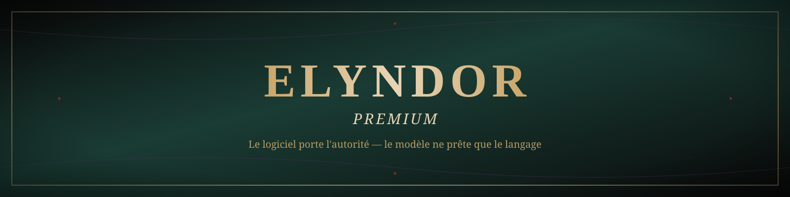

<div align="center">



<br/>

[](LICENSE)
[](https://docs.expo.dev/versions/v57.0.0/)
[](https://reactnative.dev/)
[](#roadmap)

**Le logiciel porte l'autorité — règles, mémoire, monde.**
**Le modèle ne prête que le langage.**

</div>

<br/>


## Qu'est-ce qu'Elyndor Premium ?

**Elyndor Premium** est l'édition soignée du **Logiciel RP**, une application mobile (React Native + Expo) de jeu de rôle narratif assisté par IA. Elle inverse le rapport de force habituel entre un chatbot et son modèle : ici, c'est le **logiciel** — pas le modèle de langage — qui porte le canon, la mémoire et l'état du monde. Le modèle ne fait que mettre ces faits en mots, tour après tour, sans jamais improviser une vérité qui n'aurait pas été validée par le moteur.

L'histoire se déroule dans **Elyndor**, un monde de fantasy peuplé de dizaines de peuples (hauts-elfes, orques nobles, naga marines, valkyries, sultanats, tribus primales...), porté par un lorebook de plus de 100 entrées et 15 métamoteurs narratifs qui gouvernent le ton, le rythme et la cohérence de chaque scène.

> *Ce README documente le dépôt tel qu'il existe réellement dans le code (`src/`). Pour le cadrage produit complet, voir [`Brief_Beta_Application_ClaudeCode.md`](Brief_Beta_Application_ClaudeCode.md). Pour la charte graphique de ce document et des assets `/assets/brand`, voir [`docs/elyndor-visual-identity.md`](docs/elyndor-visual-identity.md).*

<br/>

## Sommaire

- [Fonctionnalités](#fonctionnalités)
- [Architecture technique](#architecture-technique)
- [Installation](#installation)
- [Configuration](#configuration)
- [Exemples](#exemples)
- [Roadmap](#roadmap)
- [Contribuer](#contribuer)
- [Contributeurs](#contributeurs)
- [Licence](#licence)

<br/>

## Fonctionnalités

<table>
<tr>
<td width="72" valign="top"></td>
<td>

### 7 règles immuables
Injectées à chaque tour, elles priment sur tout métamoteur, tout lore et toute autre instruction : autonomie stricte du joueur, canon et état du monde gérés par le logiciel, PNJ à connaissance limitée, aucune invention du modèle validée directement en canon, contradictions interdites, l'IA ne contrôle jamais le joueur.
→ [`src/engine/rules.ts`](src/engine/rules.ts)

</td>
</tr>
<tr>
<td width="72" valign="top"></td>
<td>

### 15 métamoteurs & lore Elyndor (102 entrées)
Chargés puis **sélectionnés par similarité sémantique** (embeddings + cosinus) à chaque tour — pas par correspondance de mots-clés — afin qu'un PNJ évoqué avec un vocabulaire différent du lorebook déclenche quand même les bonnes fiches. Un socle transverse, les entrées `constant: true` et la table Géographie/Races restent toujours actifs ; l'exclusion par `negative_keys` reste une règle déterministe indépendante du score.
→ [`src/engine/embeddings.ts`](src/engine/embeddings.ts) · [`src/engine/loreLoader.ts`](src/engine/loreLoader.ts) · [`src/storage/embeddingsStore.ts`](src/storage/embeddingsStore.ts)

</td>
</tr>
<tr>
<td width="72" valign="top"></td>
<td>

### Mémoire persistante — pipeline L0 → L5
Résumé glissant régénéré tous les **8 messages**, extraction de faits candidats (personnages, lieux, promesses), déduplication par similarité d'embeddings, canonisation sous réserve d'absence de contradiction, puis décroissance douce des faits non reconfirmés (jamais de suppression brutale). Le joueur peut aussi forcer un fait en canon directement via `retiens que …`.
→ [`src/engine/memory.ts`](src/engine/memory.ts)

</td>
</tr>
<tr>
<td width="72" valign="top"></td>
<td>

### Validation de sortie
Chaque réponse passe un contrôle heuristique local (tournures qui décident à la place du joueur) puis un contrôle par le modèle (continuité, canon, contradiction). Une violation déclenche une unique nouvelle tentative — pas de réparation sophistiquée, pour rester prévisible.
→ [`src/engine/validator.ts`](src/engine/validator.ts)

</td>
</tr>
</table>

**Aussi dans le dépôt** : génération de scénario et d'ouverture de scène, simulation du monde et dynamiques sociales entre PNJ, lore émergent, export de conversation, système de plugins, contrôle de contenu adulte, reconnaissance vocale pour la dictée, portraits par peuple/genre — voir [`src/engine/`](src/engine) pour le détail.

<br/>

## Architecture technique

```
src/
├─ data/         metamoteurs.json (15 métamoteurs), elyndorLore.json (lore Elyndor, 102 entrées)
├─ engine/       cœur du moteur — voir détail ci-dessous
├─ screens/      Activation, Création, Conversation, Chargement, Réglages, Designer, Plugins
├─ navigation/   pile de navigation (React Navigation)
├─ storage/      persistance locale (AsyncStorage) — histoires, réglages, cache d'embeddings
├─ theme/        tokens visuels de l'UI in-app (« grimoire illuminé »)
├─ i18n/         chaînes localisées
├─ components/   composants d'interface réutilisables
└─ types/        types TypeScript partagés
```

| Module (`src/engine/`) | Rôle |
|---|---|
| `rules.ts` | Les 7 règles immuables |
| `embeddings.ts` | Calcul d'embeddings + similarité cosinus |
| `loreLoader.ts` | Classement et sélection du lore/métamoteurs pertinents |
| `memory.ts` | Pipeline de mémoire L0–L5 (résumé, faits, consolidation, décroissance) |
| `promptBuilder.ts` | Assemblage du contexte envoyé au modèle |
| `openrouter.ts` / `llmProvider.ts` | Appel du modèle via OpenRouter |
| `validator.ts` | Validation heuristique + modèle de chaque réponse |
| `generateTurn.ts` | Orchestration d'un tour complet |
| `storyDirector.ts` / `worldSimulation.ts` / `socialDynamics.ts` | Direction narrative et simulation du monde |
| `scenarioGenerator.ts` / `openingGenerator.ts` | Génération de scénario et d'ouverture |

**Flux de génération** : joueur écrit → sélection des métamoteurs/lore pertinents par similarité sémantique → construction du contexte (règles immuables + résumé + faits clés + lore) → appel API (OpenRouter) → validation heuristique et modèle → affichage.

<br/>

## Installation

```bash
npm install
npm start
```

Puis scanner le QR code avec l'app **Expo Go** (Android) — aucun build, aucun compte développeur nécessaire.

> ⚠️ L'écosystème Expo évolue vite : ce dépôt cible **Expo SDK 57**. En cas de doute sur une API, se référer à la documentation versionnée [docs.expo.dev/versions/v57.0.0](https://docs.expo.dev/versions/v57.0.0/) plutôt qu'à la documentation « latest ».

## Configuration

Au premier lancement, aller dans **Réglages** et renseigner :

- une clé API [OpenRouter](https://openrouter.ai/) — jamais codée en dur, stockée uniquement en local sur l'appareil ;
- un modèle (liste chargée depuis OpenRouter, ou identifiant saisi manuellement) ;
- optionnellement, une **clé API embeddings de secours** (OpenAI `text-embedding-3-small`) si OpenRouter n'en sert pas pour le compte utilisé — la sélection par similarité sémantique bascule automatiquement dessus.

<br/>

## Exemples

<table>
<tr>
<td align="center" width="25%"><br/><sub>Démarrage</sub></td>
<td align="center" width="25%"><br/><sub>Création du personnage</sub></td>
<td align="center" width="25%"><br/><sub>Point de départ de l'histoire</sub></td>
<td align="center" width="25%"><br/><sub>Préférences</sub></td>
</tr>
</table>

<br/>

## Roadmap

- [x] 7 règles immuables toujours injectées
- [x] 15 métamoteurs + lore Elyndor (102 entrées) sélectionnés par similarité sémantique
- [x] Mémoire persistante L0–L5 (résumé glissant, faits, consolidation, décroissance)
- [x] Validation heuristique + modèle de chaque réponse
- [x] Génération de scénario, simulation du monde, dynamiques sociales entre PNJ
- [ ] Portraits par émotion, ambiance sonore
- [ ] Bibliothèque de personas et branches de conversation multiples
- [ ] Parcours de création en plusieurs étapes
- [ ] Traduction au-delà du français

Voir aussi le suivi de version dans [`version.json`](version.json) et les notes de build EAS/web dans `.github/workflows/`.

<br/>

## Contribuer

Les contributions sont bienvenues — voir [`CONTRIBUTING.md`](CONTRIBUTING.md) pour le workflow, les conventions de commit et la checklist avant pull request. L'intégration continue (`.github/workflows/pr-validation.yml`) exécute les tests, la vérification de types et un export web sur chaque pull request.

## Contributeurs

<a href="https://github.com/artisanguillonrenov-creator/logiciel-rp-beta/graphs/contributors">
  
</a>

## Licence

Distribué sous licence [MIT](LICENSE).

<br/>

<div align="center">
<sub>Conçu autour d'un principe simple : un monde n'oublie rien, un joueur ne perd jamais la main.</sub>
</div>
